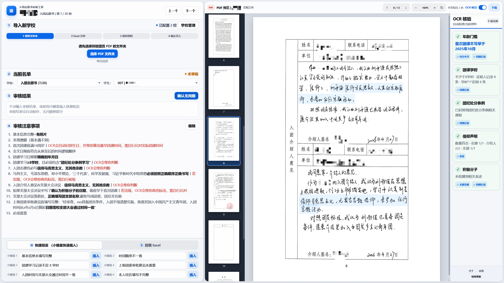

# 入团申请材料审核助手

一个面向学校批量审核工作的本地 WebUI（网页界面）工具；

具备自动检查名单中/申请书的缺失学生、手写OCR辅助检查、自动标注重要文本（马克思主义信仰声明、系列思想等）、小键盘快捷填入审核意见、审核结果批量回填Excel等功能。

亲测对比原始人版审核方法，效率至少翻五倍；

学生材料默认只在本机处理，不需要上传到第三方服务。



## 主要功能

- 引导式导入 PDF 文件夹和 Excel 名单，新手无需理解项目目录。
- 自动从复杂 PDF 文件名中提取姓名，并核对名单缺漏、错别字和多候选人员。
- 自动保存审核意见，区分“已审无问题”和“尚未审核”。
- 提供 PDF 缩略图、全局翻页快捷键、六条快捷短语和可编辑审核注意事项。
- 使用本地 OCR 辅助检查年龄门槛、团课学时、团纪课程、信仰声明和积极分子表述。
- 将整校结果写入带时间戳的 Excel 副本，不覆盖原名单。
- 启动后自动检查稳定版本更新，并在有新版本时显示未读红点。

## 快速开始

### 1. 下载与安装

从 [GitHub Releases（GitHub 发行版）](https://github.com/jzcangshu/league-review-helper/releases) 下载名称包含 `Windows-x64-Offline-Setup.exe` 的最新离线安装包，双击后按提示安装。

离线安装包适用于 64 位 Windows 10 1809 及更高版本、Windows 11。它已经内置 Node.js、Python、网页依赖和 OCR 模型，正常安装与首次启动均不需要开发环境或联网下载依赖，也不要求管理员权限。

### 2. 启动

安装完成后，从开始菜单或桌面快捷方式打开“入团申请材料审核助手”。程序会在后台启动本地服务并自动打开浏览器，不显示命令行窗口。

只有使用源码压缩包时，才需要双击根目录中的：

```text
双击我启动审核软件.cmd
```

源码版首次启动会自动准备 Node.js（网页运行环境）、Python（OCR 运行环境）、网页依赖和 OCR 模型，需要联网。普通用户优先使用离线安装包，并建议预留至少 1 GB 空间。

启动成功后会自动打开：

```text
http://127.0.0.1:4173
```

端口被占用时会自动改用后续可用端口。

## 准备资料

每所学校只需要准备两样内容：

1. 存放入团申请书或入团志愿书 PDF 的文件夹。
2. 包含学生姓名的 `.xlsx` 名单。

PDF 文件名不需要只有姓名。班级、材料类型、空格、连接符、`转PDF` 和导出编号等常见附加文字会自动清理，例如：

```text
803班 王宣淇 入团志愿书.pdf  ->  王宣淇
803彭馨凝pdf.pdf             ->  彭馨凝
806沈奕帆 .pdf               ->  沈奕帆
```

## 导入学校

左侧“导入新学校”会按顺序引导操作：

1. 选择 PDF 文件夹。
2. 选择 Excel 名单。
3. 预览程序识别出的工作表、表头、姓名列和历史审核意见。
4. 处理三类名单问题并确认导入。

名单核对分为：

- 只在名单出现，无入团申请书 PDF。
- 只有入团申请书 PDF，未出现于名单中。
- 疑似姓名录入错别字。

疑似错别字需要人工确认真实姓名，也可以选择“并非同一人，保留两人”。程序不会在多候选情况下擅自猜测。

Excel 历史审核意见优先读取“问题备注”列，其次是“问题”、唯一含“问题”的列、审核意见别名或“备注”。自动识别不正确时，可以直接在预览页修改工作表、表头行、姓名列和结果列。

## 批量审核

- “学校”和“学生”下拉框用于切换当前资料。
- 审核结果输入后自动保存，无需点击保存按钮。
- 没有问题时保持输入框为空，点击“确认无问题”会保存并切换到下一份。
- `PgUp`（向上翻页键）或 `↑`：PDF 上一页。
- `PgDn`（向下翻页键）或 `↓`：PDF 下一页。
- 小键盘 `1-6`：插入快捷短语。
- 在未审核 PDF 停留至少 10 秒并切换过页码后，切换学生时会自动标记为已审核。

程序会区分：

- 已审核且有问题：TXT 中保存审核意见。
- 已审核且无问题：TXT 为空，并在 `.review-status.json` 中记录状态。
- 未审核：预先创建的空 TXT 不会被误判为审核完成。

### 审核注意事项

注意事项可以直接在网页内编辑，每行自动编号：

- `【重点】` 或 `**重点**`：加粗显示。
- `*OCR 提示*`：红色正体显示。

保存前会在 `注意事项历史` 中保留旧版本。

## OCR 辅助核验

OCR 默认开启，首次使用会自动安装运行环境并下载模型，之后复用本地模型和识别缓存。审核当前资料时还会预识别后两份 PDF。

右侧竖栏提供五项辅助结果：

- 年龄门槛：识别出生年月并计算首次团课不可早于的月份。
- 团课学时：辅助判断是否达到 8 学时。
- 团纪处分条例：检查团课记录中是否存在相关课程。
- 信仰声明：核对志愿页、介绍人和支部页面中的声明数量。
- 积极分子提醒：发现相关表述时提醒人工比较日期。

高光颜色：

- 蓝色：辅助定位必查文字。
- 黄色：识别不完整，需要人工确认。
- 红色：明确缺失或不合规。

OCR 只负责快速定位和提醒，最终结论仍应以人工查看原 PDF 为准。

## Excel 回填

在左侧底部切换到“5. 回填 Excel”，点击“回填当前学校”。

程序会：

- 保留原 Excel 不变，在同一文件夹生成类似 `名单_7月14日_150607_审核回填.xlsx` 的副本。
- 将审核意见和“未审核”以黑字写入。
- 只有没有对应 PDF 的“无资料”使用红字。
- 自动补充确认需要新增的人员，并避免重复姓名。
- 成功时按钮变绿并显示“✓ 回填成功”，失败时变红并显示“✕ 回填失败”。
- 提供“打开 Excel 文件”和“打开所在文件夹”。

## 本地数据

```text
审核结果/学校名/               审核结果 TXT 和审核状态
审核结果历史/                  被替换的历史审核结果
Excel历史/                     导入核对时修改名单前的备份
注意事项历史/                  注意事项旧版本
review-web/sources.local.json   已导入学校路径
review-web/.ocr-cache/          OCR 识别缓存
review-web/.ocr-python/         OCR 独立环境
review-web/.ocr-models/         OCR 模型
review-web/.thumbnail-cache/    PDF 缩略图缓存
```

程序不会主动删除用户的 PDF、Excel 或审核结果。

## AI 辅助补救方案

正常情况下，WebUI 已经可以独立完成导入、核对、审核和回填，无需使用 Codex Skill（Codex 技能）。

`codex-skills/league-review-prep` 只作为罕见边缘情况的 AI 辅助补救方案，例如：

- 遇到非常规 Excel 结构，网页无法可靠判断名单区域。
- 文件命名极不规范，需要人工辅助确认姓名关系。
- 本地数据受损，需要批量核对或恢复审核状态。
- 需要由 AI 协助诊断导入、匹配或回填问题。

遇到这类情况时，可以让 Codex 阅读该技能并在人工确认下处理；不要把它当作正常使用流程中的必需步骤。

## 常见问题

### 双击后没有启动

启动脚本发生错误时不会自动关闭窗口，请直接查看其中的中文提示。详细日志位于：

```text
review-web/start-review-error.log
review-web/start-review-output.log
```

网络下载中断后可以再次双击，已经完成的部分会继续复用。

### 选择 PDF 文件夹后显示缺 PDF

确认选择的文件夹直接或递归包含 PDF。文件名可以带班级和材料类型，不需要手工改成纯姓名。

### OCR 首次运行很慢

首次运行需要安装 Python 依赖并下载模型，耗时取决于网络和电脑性能。完成后相同 PDF 会读取缓存。

### Excel 识别不正确

在导入预览第一页手动调整工作表、表头行、姓名列和审核意见列。结构不确定时程序会阻止继续操作，不会直接猜测写入位置。

## 开发与测试

```powershell
cd review-web
npm install
npm test
npm start
```

核心目录：

```text
review-web/server.js                 本地服务
review-web/public/                   网页界面
review-web/lib/import-service.js     Excel 导入与名单核对
review-web/lib/export-service.js     Excel 回填
review-web/lib/ocr-service.js        OCR 环境、模型与缓存
review-web/lib/thumbnail-service.js  PDF 缩略图生成与缓存
codex-skills/league-review-prep/     罕见情况 AI 辅助技能
```

真实学生 PDF、Excel、审核结果、身份证号和联系方式不应提交到公开仓库。

## 许可证

Apache License 2.0

## 🔗 LinuxDo 社区

<div align="center">
  <a href="https://linux.do" target="_blank">
    
  </a>
  <p>
    <a href="https://linux.do" target="_blank"><strong>LinuxDo 社区</strong></a><br>
  </p>
    <p>@蕉灼の仓鼠</p>
    <p>本人长期活跃于L站;</p>
    <p>这里的人很好说话又好听;</p>
    <p>欢迎都来加入L站大家庭。 </p>

</div>
